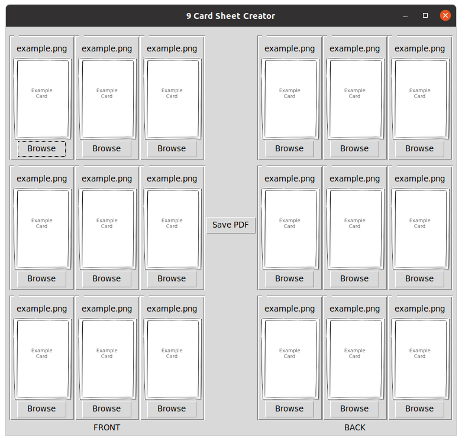

# 9 Card Sheet Creator

This is a basic gui for easily creating a 2 sided sheet with 9 playing cards on.  

## Usage
Linux:  

    ./9_card_sheet.py
Drag and drop or select files using the file dialog button.  
Cards on the back sheet will be mirrored correctly.  
Supported formats are whatever is supported by PIL (jpg,png and so on).  
sheet resolution is 300dpi  

  
## TODO
  * Add support for SVGs
  * Have some kind of config save so you don't need to re-add every image each time.
  * Add lines to show where to cut